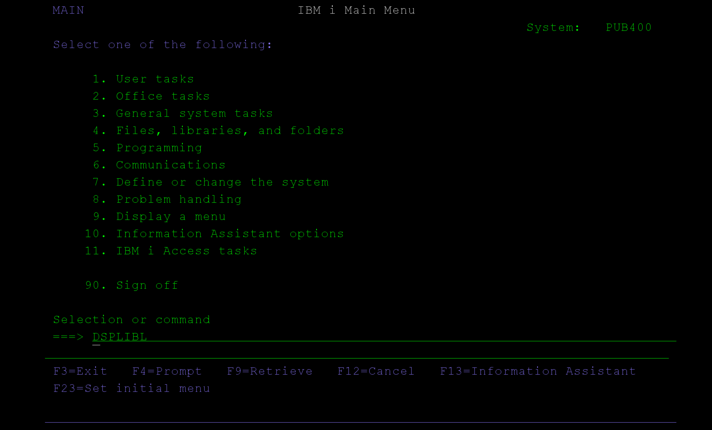

# Setup a IBMi system

if you're new to IBMi/AS400 or don't currently have a system to use, this section will guide you through setting a test 
environment using the [PUB400.com](https://www.pub400.com) service.

## What is IBMi/AS400 ?

IBMi/AS400 (now commonly referred to as IBMi on Power Systems) is a midrange computer platform developed by IBM. Originally introduced in 1988 as the AS/400 (Application System/400), it was designed for business applications, especially in industries like finance, manufacturing, and retail.

The system runs on the IBMi operating system, which is known for its stability, security, and integrated database (DB2). It supports both traditional RPG and COBOL applications as well as modern development using Java, PHP, and SQL.

Although the hardware and name have evolved over the years (from AS/400 to iSeries to System i and now IBM Power Systems running IBMi), many organizations still refer to it as AS/400 due to its long legacy.

It's therefore an entirely different platform than traditional PC computers. It's still used widely to this day in many sectors.

## What is PUB400 ?
[PUB400.com](https://www.pub400.com) is a public, free IBMi (formerly AS/400) server you can use to learn, experiment, and develop.

It’s basically a playground for IBMi: a system running IBMi version 7.5, made accessible to the community so people can try out IBMi tools, 
write programs (RPG, COBOL, CL, SQL, etc.), use open‑source/modern tooling, and generally build skills.

## 1) PUB400.com sign-up & connection test

Opening a free account is really easy, head to sign-up page and fill up this form :


You'll receive a first email to confirm your email address, and then, another one to give you more details 
on how to use your new test system.

IBMi/AS400 systems often requires you to go through a dedicated tn5250 terminal emulator. For our use cases, 
you'll need the terminal to enable [journaling](./journaling.md) on your source tables.

We recommend you to use a JAVA-based multi-platform terminal [tn5250j](http://tn5250j.org/)
Make sure JAVA is installed, simply download the zip distribution and unzip it to your install folder.

Run the command ```java -jar ./tn5250j.jar``` and configure your connection to pub400.com. The logon window looks like this :


On first login, your password will need to be changed, use [TAB] to move for one field to another.

On the welcome page, try running the command ```DSPLIBL``` to display the list of libraries/schemas.



Now the result will look like this


That's great, it means that PUB400 has already created a sample schema called ```${YOUR_USERNAME}1```


## 2) SQL connection
IBMi has an embedded DB2 SQL database tightly coupled with the system. Tables are files and vice versa. That's why, 
there's no need to install a SQL server.

### Query test

Now, try to connect to our library by using an ordinary JDBC-based SQL client. In this example, 
connection string is simply ```jdbc:as400://pub400.COM;libraries={YOUR_USERNAME}1```. Here's a screenshot of [DBeaver](https://dbeaver.io/)


### Build schema

Time to build our first test database. This database will be used later on to do replication tests with Snowflake.
Run the following creation script :

```
-- 1. Categories Table
CREATE TABLE Categories (
    CategoryID INTEGER GENERATED ALWAYS AS IDENTITY (START WITH 1 INCREMENT BY 1) PRIMARY KEY,
    CategoryName VARCHAR(100) NOT NULL,
    Description VARCHAR(500)
);

-- 2. Suppliers Table
CREATE TABLE Suppliers (
    SupplierID INTEGER GENERATED ALWAYS AS IDENTITY (START WITH 1 INCREMENT BY 1) PRIMARY KEY,
    SupplierName VARCHAR(150) NOT NULL,
    ContactName VARCHAR(100),
    Address VARCHAR(200),
    Phone VARCHAR(50),
    Email VARCHAR(100)
);

-- 3. Products Table
CREATE TABLE Products (
    ProductID INTEGER GENERATED ALWAYS AS IDENTITY (START WITH 1 INCREMENT BY 1) PRIMARY KEY,
    ProductName VARCHAR(150) NOT NULL,
    CategoryID INTEGER,
    SupplierID INTEGER,
    UnitPrice DECIMAL(10, 2),
    ReorderLevel INTEGER DEFAULT 10,
    Discontinued SMALLINT DEFAULT 0,
    FOREIGN KEY (CategoryID) REFERENCES Categories(CategoryID),
    FOREIGN KEY (SupplierID) REFERENCES Suppliers(SupplierID)
);

-- 4. Stock Table
CREATE TABLE Stock (
    StockID INTEGER GENERATED ALWAYS AS IDENTITY (START WITH 1 INCREMENT BY 1) PRIMARY KEY,
    ProductID INTEGER NOT NULL,
    QuantityInStock INTEGER NOT NULL,
    LastUpdated TIMESTAMP DEFAULT CURRENT_TIMESTAMP,
    FOREIGN KEY (ProductID) REFERENCES Products(ProductID)
);

-- 5. Purchases Table
CREATE TABLE Purchases (
    PurchaseID INTEGER GENERATED ALWAYS AS IDENTITY (START WITH 1 INCREMENT BY 1) PRIMARY KEY,
    ProductID INTEGER NOT NULL,
    SupplierID INTEGER NOT NULL,
    Quantity INTEGER NOT NULL,
    PurchaseDate DATE NOT NULL,
    UnitCost DECIMAL(10, 2),
    FOREIGN KEY (ProductID) REFERENCES Products(ProductID),
    FOREIGN KEY (SupplierID) REFERENCES Suppliers(SupplierID)
);

-- 6. Sales Table
CREATE TABLE Sales (
    SaleID INTEGER GENERATED ALWAYS AS IDENTITY (START WITH 1 INCREMENT BY 1) PRIMARY KEY,
    ProductID INTEGER NOT NULL,
    Quantity INTEGER NOT NULL,
    SaleDate DATE NOT NULL,
    UnitPrice DECIMAL(10, 2),
    FOREIGN KEY (ProductID) REFERENCES Products(ProductID)
);
```

### Fill up the database

Now let's insert simulated data :

```
INSERT INTO Categories (CategoryName, Description) VALUES
('Electronics', 'Devices and gadgets'),
('Groceries', 'Daily consumables and food items'),
('Stationery', 'Office and school supplies');


INSERT INTO Suppliers (SupplierName, ContactName, Address, Phone, Email) VALUES
('TechSource Ltd.', 'Alice Johnson', '123 Tech Ave', '555-1234', 'alice@techsource.com'),
('FoodWorld Inc.', 'Bob Smith', '789 Market St', '555-5678', 'bob@foodworld.com'),
('OfficePlus', 'Carol Lee', '456 Office Rd', '555-9012', 'carol@officeplus.com');


INSERT INTO Products (ProductName, CategoryID, SupplierID, UnitPrice, ReorderLevel, Discontinued) VALUES
('USB Flash Drive 32GB', 1, 1, 12.99, 20, 0),
('Organic Apples 1kg', 2, 2, 3.49, 50, 0),
('Notebook A4', 3, 3, 1.25, 100, 0);

INSERT INTO Stock (ProductID, QuantityInStock) VALUES
(1, 150),
(2, 300),
(3, 500);

INSERT INTO Purchases (ProductID, SupplierID, Quantity, PurchaseDate, UnitCost) VALUES
(1, 1, 200, DATE('2025-09-10'), 10.00),
(2, 2, 500, DATE('2025-09-15'), 2.50),
(3, 3, 1000, DATE('2025-09-12'), 0.90);

INSERT INTO Sales (ProductID, Quantity, SaleDate, UnitPrice) VALUES
(1, 50, DATE('2025-09-18'), 14.99),
(2, 100, DATE('2025-09-19'), 3.99),
(3, 250, DATE('2025-09-20'), 1.50);

```

## What's next ?

Well done, you've just created a functional IBMi test environment. Both SQL and command line are functional. 
From there, it's straightforward to develop basic queries and applications with JDBC for instance. 
A lot of valuable information can be found on [PUB400.COM](https://www.pub400.com) to help you dive deeper into the [command line](https://www.ibm.com/docs/en/i/7.4.0?topic=product-i-commands).

In our next step, we will use the terminal to configure our source tables with [journaling](journaling.md) enabled. 