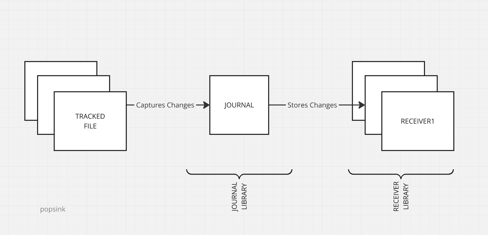

# DB2 Journaling

## What is journaling ?

Journaling is a mechanism used in database systems to log all data modification operations (such as INSERT, UPDATE, 
and DELETE) to a sequential transaction log (journal) separate from the base tables. 
This log provides a reliable, auditable trail of changes, supports crash recovery, and enables data consistency
across system failures.

For mission-critical environments, proper journaling setup and receiver management are essential to ensure data 
integrity and minimize downtime.

## What is Change Data Capture ? (CDC)

Change data capture is a technique involving listening to a DB journal to extract the changes since a certain point 
in time and apply these changes to an external system.

This is a particularly efficient way to replicate (i.e. synchronize) one database onto another. No need for a sophisticated setup 
on the source database, a pre-existing journal can be used as it's often the case on critical databases.

The synchronization doesn't need to periodically scan a list of tables as the journal centralizes the changes.

## How is Journaling implemented on IBMi DB2 ?

DB2 tracks **multiple tables** with a designated **journal** witch itself delegates the storage to a **receiver**.

While it's possible to have multiple journals assigned to tables belonging to the same library (or schema), it's 
recommended to create a single journal for an entire DB2 instance or a single journal per schema.

A schema often reflects a single unit of work with few transactions overlapping schemas.



## Configure DB2 Journal

On IBMi, everything is an object, that is a file under a library. Consider libraries as the equivalent of folders in recent systems.
In the following examples, use your own library name as defined by your DB2 setup.

Use a tn5250 terminal emulator to connect to your IBMi environment and run the following commands.

### 1.  Create a Journal Receiver

This command creates a receiver named MY_RCVER under the library POPSINK1 :

```CRTJRNRCV POPSINK1/MY_RCVER```

### 2. Create a Journal

This command creates a journal named MY_JOURNAL attached to MY_RCVER under the library POPSINK1 :

```CRTJRN POPSINK1/MY_JOURNAL POPSINK1/MY_RCVER```

### 3. Enable Journaling on source tables

For each table to replicate named ${TABLE}, run the command :

```STRJRNPF POPSINK1/${TABLE} POPSINK1/MY_JOURNAL```

That is, based on the tables created previously in [DB2 setup](./db2_setup.md) :

```
STRJRNPF POPSINK1/CATEGORIES POPSINK1/MY_JOURNAL
STRJRNPF POPSINK1/SUPPLIERS POPSINK1/MY_JOURNAL
STRJRNPF POPSINK1/PRODUCTS POPSINK1/MY_JOURNAL
STRJRNPF POPSINK1/STOCK POPSINK1/MY_JOURNAL
STRJRNPF POPSINK1/PURCHASES POPSINK1/MY_JOURNAL
STRJRNPF POPSINK1/SALES POPSINK1/MY_JOURNAL
```

### 4. Give relevant rights to the CDC user

Your account (here POPSINK for example) needs to be allowed to read from the journal :

```
GRTOBJAUT OBJ(POPSINK1) OBJTYPE(*LIB) USER(POPSINK) AUT(*EXECUTE)
GRTOBJAUT OBJ(POPSINK1/*ALL) OBJTYPE(*JRNRCV) USER(POPSINK) AUT(*USE)
GRTOBJAUT OBJ(POPSINK1/MY_JOURNAL) OBJTYPE(*JRN) USER(POPSINK) AUT(*USE *OBJEXIST)
GRTOBJAUT OBJ(POPSINK1/MY_JOURNAL) OBJTYPE(*JRN) USER(POPSINK) AUT(*OBJEXIST)

GRTOBJAUT OBJ(POPSINK1/*ALL) OBJTYPE(*FILE) USER(POPSINK) AUT(*USE)
```

### 5. Switch journaling from *AFTER to *BOTH

By default, journaling only stores the image after the change, not the one before. This can make certain operations 
complex, for instance primary key updates - these cannot be handled unless both images are available.

Besides, with both images, Snowflake replication will provide more information on DELETE operations.

For each table to replicate named ${TABLE}, run the command :

```
CHGJRNOBJ OBJ((POPSINK1/${TABLE} *FILE)) ATR(*IMAGES) IMAGES(*BOTH)
```

That is, based on the tables created previously in [DB2 setup](./db2_setup.md) :

```
CHGJRNOBJ OBJ((POPSINK1/CATEGORIES *FILE)) ATR(*IMAGES) IMAGES(*BOTH)
CHGJRNOBJ OBJ((POPSINK1/SUPPLIERS *FILE)) ATR(*IMAGES) IMAGES(*BOTH)
CHGJRNOBJ OBJ((POPSINK1/PRODUCTS *FILE)) ATR(*IMAGES) IMAGES(*BOTH)
CHGJRNOBJ OBJ((POPSINK1/STOCK *FILE)) ATR(*IMAGES) IMAGES(*BOTH)
CHGJRNOBJ OBJ((POPSINK1/PURCHASES *FILE)) ATR(*IMAGES) IMAGES(*BOTH)
CHGJRNOBJ OBJ((POPSINK1/SALES *FILE)) ATR(*IMAGES) IMAGES(*BOTH)
```

## Conclusion

Journaling requires additional I/O and storage space. While not covered in this guide, monitoring 
and periodically deleting old journal entries is essential to save disk space.

Well Done ! you are finally ready to start replicating data from IBMi DB2 using Popsink technology.

Jump straight to our [quickstart](./quickstart.md) if you've installed Popsink's Snowflake IBMi connector.

