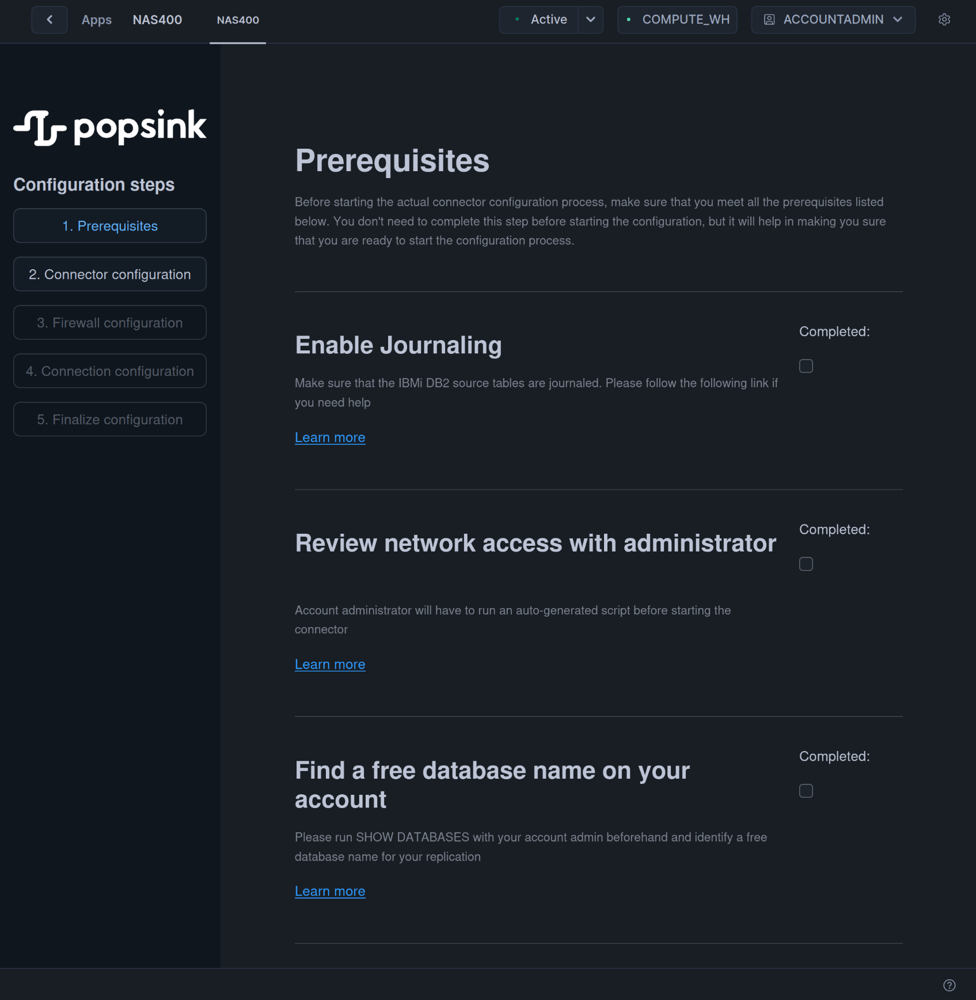
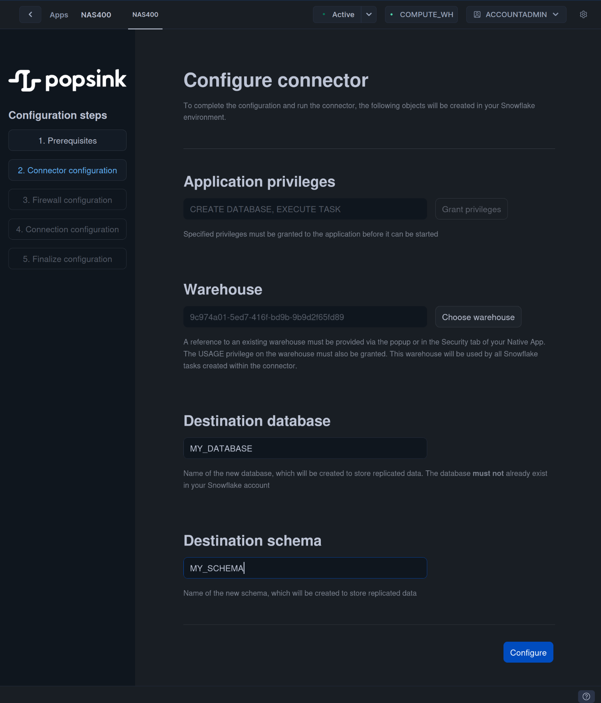
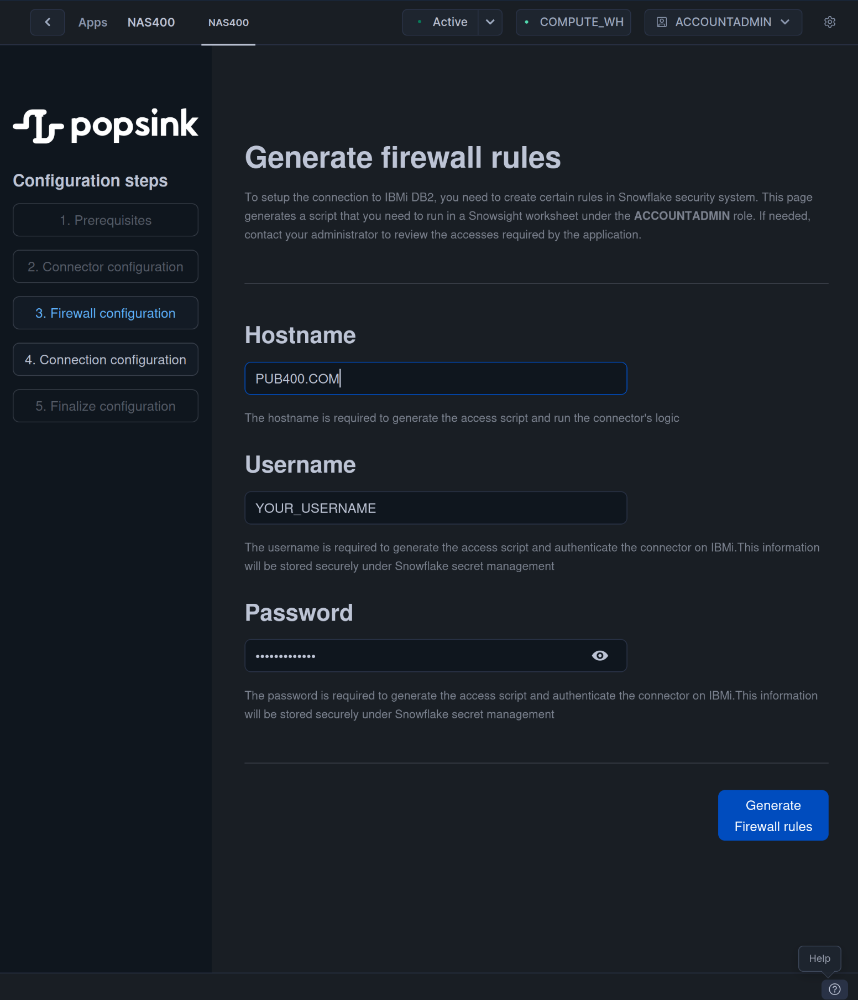
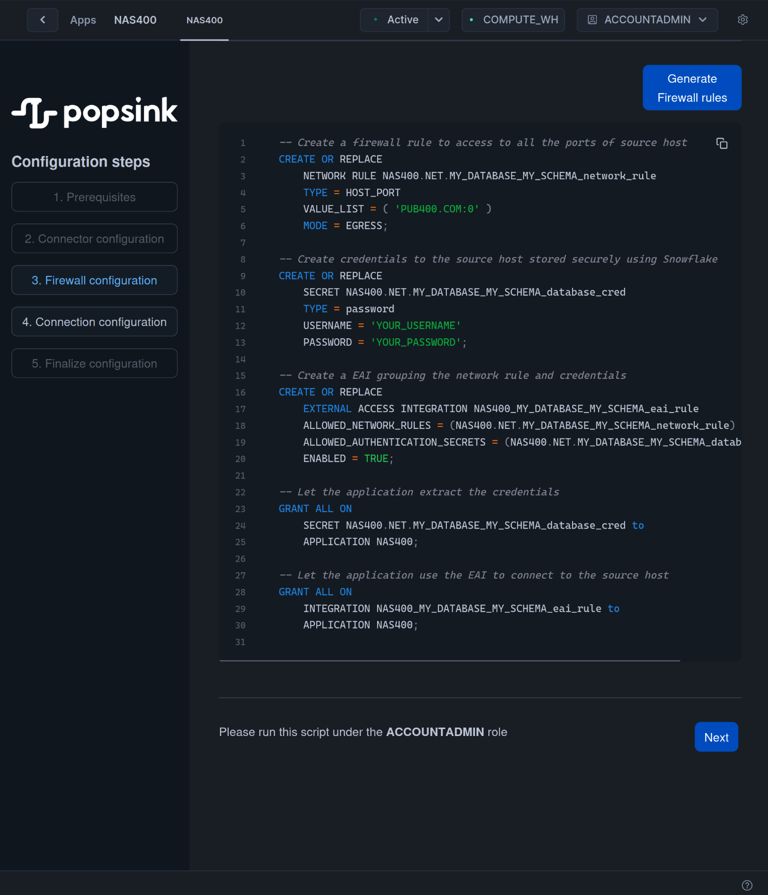
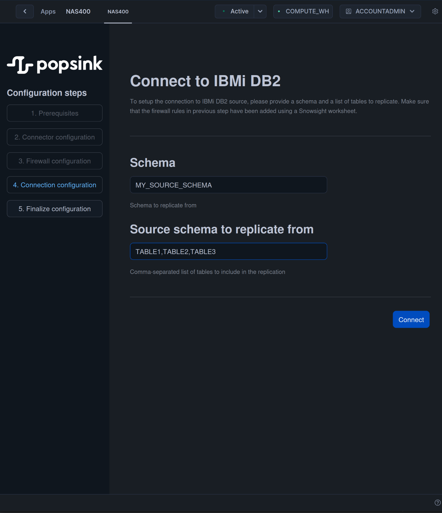
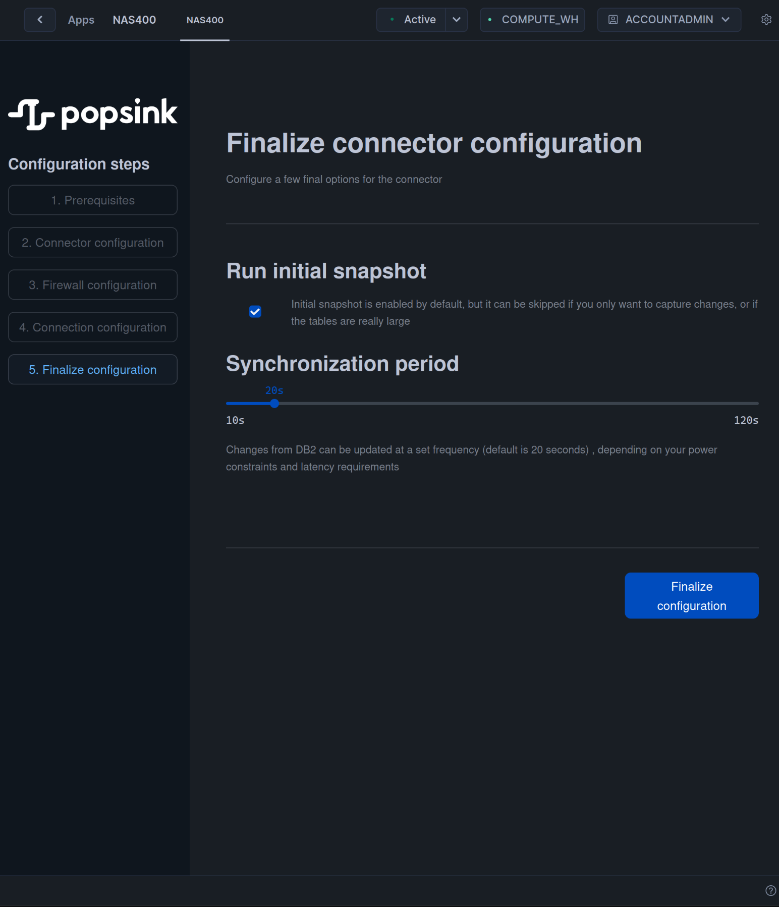

# Quickstart

You've just downloaded Popsink's connector to IBMi DB2 from Snowflake's Marketplace, and you're now eager to run your 
first replication. Then, you've come to right the place !

On first launch, the application will welcome you with a step-by-step configuration wizard that you can pause and resume any
time, your progress will be saved.

If you're entirely new to
IBMi/AS400 and currently have no system to connect to, please head to [this page](./db2_setup.md), follow the instructions 
and start experimenting with your new DB2 system.

If not, you've already got a DB2 system in place, and you want to replicate it, please continue. 

## 1. Prerequisites

In this important step, the user goes through a check-list of actions that need to be taken before moving on to the next
steps. Not everything can be setup through the user interface, often for security reasons.



### 1.1 Enable Journaling

It's a vital step to capture changes from the source databases with no additional overhead. Please head to [journaling](./journaling.md), 
if you need help setting it up on your DB2 environment.

Take notes of the journaled tables you'd like to replicate.

### 1.2 Review network access

In a later step, the app will generate SQL commands that only a user with ```ACCOUNTADMIN``` privileges can run. 
This will open network access to the source database. Please make sure your administrator is informed that the app needs 
access to all the port of the source database.

### 1.3 Find an available name for the target database

Snowflake's security prevents an app to list all the existing databases and schemas. That's why your administrator needs to run
```SHOW DATABASES``` to confirm that your choice of target database name is valid.

When you're ready you can mark the prerequisites as **'Completed'** and move to the next step.

## 2. Connector's Configuration
On this page, you will configure a few simple but essential settings :

- Grant privileges to create the target database and run synchronization tasks.
- Define what warehouse to connect to. The running costs of the app will be billed to this warehouse.
- Define the target database name. You **must** choose an available name.
- Define the schema name storing the replicated tables.



When you're finished, click on **'Configure'**.

## 3. Firewall & Credentials Configuration

Next step is to set up your connection to your source IBMi system. You will need 2 things :

- A network access to your hostname.
- A username & password to an account with rights to read the DB2 journal.

Snowflake has an embedded system of [external access integration (EAI)](https://docs.snowflake.com/en/developer-guide/external-network-access/creating-using-external-network-access) that securely declares the port your 
connection requires, as well as credential data (here a simple username/password pair, the only mean to connect to IBMi)



When you've entered all the fields, clicking on **'Generate firewall rules'** will show a SQL Script to pass on to 
your account admin. He will be able to run and add the required objects to move on to the next step.

The password is transferred in clear to your admin but is stored securely in Snowflake, nothing but the app can access 
it.



When you're ready to test the connection and move to the next step, click on **'Next'**.

## 4. DB2 Connection's Configuration

Now your connection to DB2 is valid, it's time to define the source data you want to replicate in this simple step :

1. Choose a source schema.
2. Enter a comma-separated list of journaled tables belonging to this schema.

These tables have to be assigned to the same DB2 journal.

Click on **'Connect'** to move to the last step.



## 5. Finalize

To finish with, a few settings can be modified before starting the replication :

1. In case a source table is really large, or you only want to capture changes, it's possible to skip the initial snapshot with the following checkbox.
2. By default, synchronization period is 20 seconds, meaning the changes will be read from DB2 every 20 seconds by a Snowflake's scheduled task. It's possible to change this setting according to your latency and power requirements. A larger period means higher latencies but less compute usage.



Click on **'Finalize Configuration'** to start the replication.

## Monitor the replication

Snowflake will now run 3 different tasks (or 2 if you've decided to skip the initial snapshot) :

- **```AS400_CREATE_TARGET```** - creates the target tables in the target schema. replicated tables will be prefixed by ```POPSINK_```.
- **```AS400_SNAPSHOT```** - selects all the source data at startup time and fills the target tables.
- **```AS400_SYNC```** - polls the DB2 journal to load all the changes since last synchronization and update target tables accordingly.

They can be viewed under the Task menu of Snowflake.